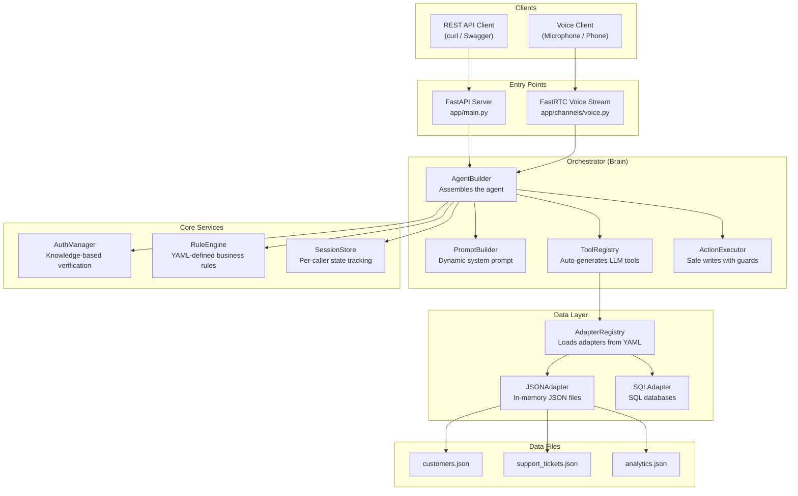
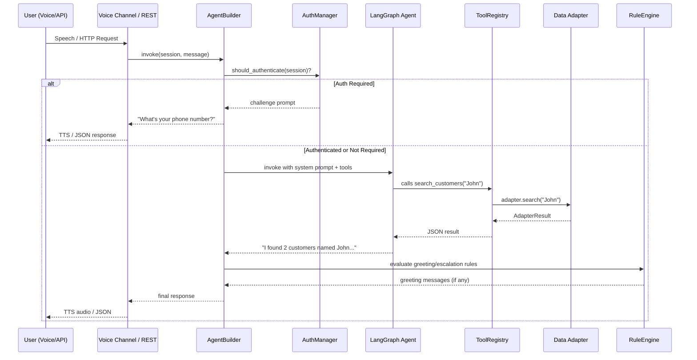

# Enterprise AI Agent Backend — Codebase Walkthrough

## Overview

This is a **voice-enabled AI customer service agent** built for "Pizza Express" (configurable to any business). It provides **two interfaces** — a REST API and a real-time voice conversation — backed by a LangGraph ReAct agent that queries CRM, support tickets, and analytics data.



---

## Configuration Hub: [business_config.yaml](file:///c:/Users/Ahad/Desktop/Atricence%20Project%20-%20Abdul%20Ahad%20Rauf%20IITM%20-%20Copy/business_config.yaml)

> [!IMPORTANT]
> This single YAML file is the **heart of the system**. A business edits this one file to configure everything — no code changes needed.

| Section | Purpose |
|---|---|
| `company` | Name & industry |
| [agent](file:///c:/Users/Ahad/Desktop/Atricence%20Project%20-%20Abdul%20Ahad%20Rauf%20IITM%20-%20Copy/app/orchestrator/agent_builder.py#122-138) | LLM model, personality, greeting, TTS/STT models, voice result caps |
| [adapters](file:///c:/Users/Ahad/Desktop/Atricence%20Project%20-%20Abdul%20Ahad%20Rauf%20IITM%20-%20Copy/app/adapters/adapter_registry.py#52-66) | Data sources (type: json/sql, source path, searchable fields, writable flag) |
| [auth](file:///c:/Users/Ahad/Desktop/Atricence%20Project%20-%20Abdul%20Ahad%20Rauf%20IITM%20-%20Copy/app/orchestrator/agent_builder.py#238-241) | Authentication strategy (knowledge/OTP/none), challenge questions |
| `business_rules` | Greeting rules, guard rules (block actions), escalation triggers |
| `knowledge` | RAG sources (disabled by default) |
| `escalation` | Human handoff via webhook/slack |
| `performance` | Filler messages, cache TTL, prefetch settings |

---

## Layer-by-Layer Walkthrough

### 1. Data Layer — Adapters

```
app/adapters/
├── base_adapter.py      → Abstract interface (fetch, search, get_by_id, update, create)
├── json_adapter.py      → JSON file implementation (in-memory, with caching)
├── sql_adapter.py       → SQL database implementation
└── adapter_registry.py  → Factory that reads YAML config → instantiates adapters
```

**How it works:**
1. [base_adapter.py](file:///c:/Users/Ahad/Desktop/Atricence%20Project%20-%20Abdul%20Ahad%20Rauf%20IITM%20-%20Copy/app/adapters/base_adapter.py) defines the contract: [fetch()](file:///c:/Users/Ahad/Desktop/Atricence%20Project%20-%20Abdul%20Ahad%20Rauf%20IITM%20-%20Copy/app/adapters/json_adapter.py#63-94), [search()](file:///c:/Users/Ahad/Desktop/Atricence%20Project%20-%20Abdul%20Ahad%20Rauf%20IITM%20-%20Copy/app/adapters/base_adapter.py#75-79), [get_by_id()](file:///c:/Users/Ahad/Desktop/Atricence%20Project%20-%20Abdul%20Ahad%20Rauf%20IITM%20-%20Copy/app/adapters/json_adapter.py#95-109), [update()](file:///c:/Users/Ahad/Desktop/Atricence%20Project%20-%20Abdul%20Ahad%20Rauf%20IITM%20-%20Copy/app/adapters/base_adapter.py#82-91), [create()](file:///c:/Users/Ahad/Desktop/Atricence%20Project%20-%20Abdul%20Ahad%20Rauf%20IITM%20-%20Copy/app/adapters/base_adapter.py#92-99), [get_schema()](file:///c:/Users/Ahad/Desktop/Atricence%20Project%20-%20Abdul%20Ahad%20Rauf%20IITM%20-%20Copy/app/adapters/base_adapter.py#102-109), [get_tool_definitions()](file:///c:/Users/Ahad/Desktop/Atricence%20Project%20-%20Abdul%20Ahad%20Rauf%20IITM%20-%20Copy/app/adapters/base_adapter.py#110-117)
2. [json_adapter.py](file:///c:/Users/Ahad/Desktop/Atricence%20Project%20-%20Abdul%20Ahad%20Rauf%20IITM%20-%20Copy/app/adapters/json_adapter.py) loads JSON files from disk, caches them in memory, and implements filtering/search/pagination all in-memory. It also **auto-generates OpenAI-compatible tool definitions** from its config.
3. [adapter_registry.py](file:///c:/Users/Ahad/Desktop/Atricence%20Project%20-%20Abdul%20Ahad%20Rauf%20IITM%20-%20Copy/app/adapters/adapter_registry.py) reads the [adapters](file:///c:/Users/Ahad/Desktop/Atricence%20Project%20-%20Abdul%20Ahad%20Rauf%20IITM%20-%20Copy/app/adapters/adapter_registry.py#52-66) section of [business_config.yaml](file:///c:/Users/Ahad/Desktop/Atricence%20Project%20-%20Abdul%20Ahad%20Rauf%20IITM%20-%20Copy/business_config.yaml) and instantiates the right adapter class for each entry (json → [JSONAdapter](file:///c:/Users/Ahad/Desktop/Atricence%20Project%20-%20Abdul%20Ahad%20Rauf%20IITM%20-%20Copy/app/adapters/json_adapter.py#19-279), sql → `SQLAdapter`). Exposed as a **singleton** via [get_registry()](file:///c:/Users/Ahad/Desktop/Atricence%20Project%20-%20Abdul%20Ahad%20Rauf%20IITM%20-%20Copy/app/adapters/adapter_registry.py#152-159).

---

### 2. Sessions — Per-Caller State

```
app/sessions/
├── session.py        → Session dataclass (auth state, messages, cached data)
└── session_store.py  → In-memory store with timeout-based cleanup
```

**[Session](file:///c:/Users/Ahad/Desktop/Atricence%20Project%20-%20Abdul%20Ahad%20Rauf%20IITM%20-%20Copy/app/sessions/session.py)** tracks per-caller state:
- Identity: [id](file:///c:/Users/Ahad/Desktop/Atricence%20Project%20-%20Abdul%20Ahad%20Rauf%20IITM%20-%20Copy/app/adapters/json_adapter.py#95-109), `channel` (voice/chat/api), `tenant_id`
- Auth: `authenticated`, `customer_id`, `customer_profile`, `auth_attempts`
- Conversation: `messages[]`, timestamps
- Resolution: `resolved`, `escalated`, `escalation_reason`

**[SessionStore](file:///c:/Users/Ahad/Desktop/Atricence%20Project%20-%20Abdul%20Ahad%20Rauf%20IITM%20-%20Copy/app/sessions/session_store.py)** manages the lifecycle — create, retrieve, end, and auto-expire sessions after a configurable timeout (default 1 hour).

---

### 3. Authentication — Knowledge-Based Verification

```
app/auth/
├── base_authenticator.py   → Abstract auth interface
├── knowledge_auth.py       → Challenge/response verifier
└── auth_manager.py         → Orchestrates the auth flow
```

**Flow:**
1. [AuthManager](file:///c:/Users/Ahad/Desktop/Atricence%20Project%20-%20Abdul%20Ahad%20Rauf%20IITM%20-%20Copy/app/auth/auth_manager.py) reads the [auth](file:///c:/Users/Ahad/Desktop/Atricence%20Project%20-%20Abdul%20Ahad%20Rauf%20IITM%20-%20Copy/app/orchestrator/agent_builder.py#238-241) config and creates a [KnowledgeAuthenticator](file:///c:/Users/Ahad/Desktop/Atricence%20Project%20-%20Abdul%20Ahad%20Rauf%20IITM%20-%20Copy/app/auth/knowledge_auth.py#28-193)
2. When a caller connects, the agent presents challenge questions (e.g., "What's your phone number?")
3. [KnowledgeAuthenticator](file:///c:/Users/Ahad/Desktop/Atricence%20Project%20-%20Abdul%20Ahad%20Rauf%20IITM%20-%20Copy/app/auth/knowledge_auth.py) searches the customer adapter for a match, then verifies subsequent answers against the matched record
4. On success → `session.authenticated = True` with customer profile cached
5. On failure after max attempts → session locked out with a failure message

---

### 4. Business Rules Engine

```
app/rules/
├── rule_models.py   → RuleAction, RuleEvalContext dataclasses
└── rule_engine.py   → Evaluates YAML conditions against runtime context
```

**[RuleEngine](file:///c:/Users/Ahad/Desktop/Atricence%20Project%20-%20Abdul%20Ahad%20Rauf%20IITM%20-%20Copy/app/rules/rule_engine.py)** supports three rule categories:

| Category | Example | Effect |
|---|---|---|
| **Greeting** | `customer.days_since_last_order > 14` | Injects "Welcome back!" message |
| **Guards** | `order.status == 'in_transit'` | Blocks `update_order` action |
| **Escalation** | `session.auth_attempts >= 3` | Escalates to human agent |

Conditions are evaluated using a **safe eval** with [_DotDict](file:///c:/Users/Ahad/Desktop/Atricence%20Project%20-%20Abdul%20Ahad%20Rauf%20IITM%20-%20Copy/app/rules/rule_engine.py#162-178) wrappers (supports dot-notation like `order.status`). Dangerous patterns (`import`, [exec](file:///c:/Users/Ahad/Desktop/Atricence%20Project%20-%20Abdul%20Ahad%20Rauf%20IITM%20-%20Copy/app/orchestrator/action_executor.py#70-174), `os.`) are blocked.

---

### 5. Orchestrator — The Brain

```
app/orchestrator/
├── agent_builder.py    → Central initialization + invoke() method
├── prompt_builder.py   → Dynamic system prompt from config
├── tool_registry.py    → Auto-generates LangChain @tool functions
└── action_executor.py  → Write operations with auth/rules/confirmation checks
```

#### [AgentBuilder](file:///c:/Users/Ahad/Desktop/Atricence%20Project%20-%20Abdul%20Ahad%20Rauf%20IITM%20-%20Copy/app/orchestrator/agent_builder.py) — The Central Hub

[initialize()](file:///c:/Users/Ahad/Desktop/Atricence%20Project%20-%20Abdul%20Ahad%20Rauf%20IITM%20-%20Copy/app/orchestrator/agent_builder.py#66-121) wires everything together:
1. Loads [AdapterRegistry](file:///c:/Users/Ahad/Desktop/Atricence%20Project%20-%20Abdul%20Ahad%20Rauf%20IITM%20-%20Copy/app/adapters/adapter_registry.py#30-145) from YAML
2. Creates [RuleEngine](file:///c:/Users/Ahad/Desktop/Atricence%20Project%20-%20Abdul%20Ahad%20Rauf%20IITM%20-%20Copy/app/rules/rule_engine.py#25-160) from business rules
3. Creates [AuthManager](file:///c:/Users/Ahad/Desktop/Atricence%20Project%20-%20Abdul%20Ahad%20Rauf%20IITM%20-%20Copy/app/auth/auth_manager.py#20-126) with adapter references
4. Creates [ActionExecutor](file:///c:/Users/Ahad/Desktop/Atricence%20Project%20-%20Abdul%20Ahad%20Rauf%20IITM%20-%20Copy/app/orchestrator/action_executor.py#52-197) (safe writes)
5. Builds [PromptBuilder](file:///c:/Users/Ahad/Desktop/Atricence%20Project%20-%20Abdul%20Ahad%20Rauf%20IITM%20-%20Copy/app/orchestrator/prompt_builder.py#24-152) (dynamic system prompt)
6. Auto-generates LangChain tools via `ToolRegistry`
7. Builds a **LangGraph ReAct agent** with `create_react_agent()`

[invoke(session, message)](file:///c:/Users/Ahad/Desktop/Atricence%20Project%20-%20Abdul%20Ahad%20Rauf%20IITM%20-%20Copy/app/orchestrator/agent_builder.py#182-232) handles each turn:
1. Checks if auth is needed → returns challenge if first interaction
2. Calls the LangGraph agent with message
3. Evaluates greeting rules post-auth
4. Returns the response text

#### [PromptBuilder](file:///c:/Users/Ahad/Desktop/Atricence%20Project%20-%20Abdul%20Ahad%20Rauf%20IITM%20-%20Copy/app/orchestrator/prompt_builder.py)

Dynamically constructs a system prompt with 5 sections:
1. **Identity** — Company name + personality
2. **Data sources** — Schemas of all registered adapters
3. **Business rules** — Rendered as natural language instructions
4. **Auth state** — Whether the caller is verified
5. **Voice guidelines** — Keep responses short, confirm before writes

#### [ToolRegistry](file:///c:/Users/Ahad/Desktop/Atricence%20Project%20-%20Abdul%20Ahad%20Rauf%20IITM%20-%20Copy/app/orchestrator/tool_registry.py)

Auto-generates LangChain `@tool` functions for each adapter:
- `search_{name}` — text search across search fields
- `get_{name}` — list with pagination & filters
- `get_{name}_by_id` — single record lookup
- `update_{name}` — write (only if `writable: true`)

#### [ActionExecutor](file:///c:/Users/Ahad/Desktop/Atricence%20Project%20-%20Abdul%20Ahad%20Rauf%20IITM%20-%20Copy/app/orchestrator/action_executor.py)

Before any write:
1. ✅ Auth check — is the caller verified?
2. ✅ Guard rules — is the action blocked (e.g., order in transit)?
3. ✅ Confirmation — read back changes and ask user to confirm
4. ✅ Execute & audit log

---

### 6. Interfaces

#### REST API — [app/main.py](file:///c:/Users/Ahad/Desktop/Atricence%20Project%20-%20Abdul%20Ahad%20Rauf%20IITM%20-%20Copy/app/main.py)

FastAPI server with CORS, routes for `/data/crm`, `/data/support`, `/data/analytics`, `/tools/schema`, and `/health`. Run with:
```
uvicorn app.main:app --reload
```

#### Voice — Two Implementations

| File | Description |
|---|---|
| [src/fastrtc_data_stream.py](file:///c:/Users/Ahad/Desktop/Atricence%20Project%20-%20Abdul%20Ahad%20Rauf%20IITM%20-%20Copy/src/fastrtc_data_stream.py) | **Original** voice agent — uses hardcoded connectors, single-thread, no auth/sessions |
| [app/channels/voice.py](file:///c:/Users/Ahad/Desktop/Atricence%20Project%20-%20Abdul%20Ahad%20Rauf%20IITM%20-%20Copy/app/channels/voice.py) | **Enterprise** voice agent — uses [AgentBuilder](file:///c:/Users/Ahad/Desktop/Atricence%20Project%20-%20Abdul%20Ahad%20Rauf%20IITM%20-%20Copy/app/orchestrator/agent_builder.py#39-253), sessions, filler messages, auth flow |

Both share the same pipeline: **Audio → Groq Whisper STT → LLM Agent → Groq TTS → Audio Out**

The enterprise version adds:
- Per-caller sessions
- Filler messages during slow queries (configurable timeout)
- Auth flow integration
- Business rule evaluation

---

### 7. Legacy Layer — `src/` and `app/connectors/`

The `src/` directory contains the **original** pre-enterprise code:
- [data_connector_agent.py](file:///c:/Users/Ahad/Desktop/Atricence%20Project%20-%20Abdul%20Ahad%20Rauf%20IITM%20-%20Copy/src/data_connector_agent.py) — Manually defines 7 LangChain tools for CRM/support/analytics
- [process_groq_tts.py](file:///c:/Users/Ahad/Desktop/Atricence%20Project%20-%20Abdul%20Ahad%20Rauf%20IITM%20-%20Copy/src/process_groq_tts.py) — Converts Groq TTS WAV response to numpy arrays for FastRTC

The enterprise version **replaces** the manual tool definitions with auto-generated ones from the adapter registry.

---

### 8. Verification — `verify_enterprise.py`

[verify_enterprise.py](file:///c:/Users/Ahad/Desktop/Atricence%20Project%20-%20Abdul%20Ahad%20Rauf%20IITM%20-%20Copy/verify_enterprise.py) is a quick smoke-test script that validates all enterprise modules load correctly:

| Test | What it checks |
|---|---|
| `test_yaml_config` | Config loads, has company name, adapters, auth, rules |
| `test_base_adapter` | `AdapterResult` and `AdapterSchema` import OK |
| `test_json_adapter` | JSONAdapter creates, schema + tool definitions work |
| `test_session` | Session creation and store tracking |
| `test_rule_engine` | Guard blocking in-transit orders, greeting rules |
| `test_adapter_registry` | Registry loads ≥3 adapters with auto-generated tools |

---

## Request Flow — End to End


